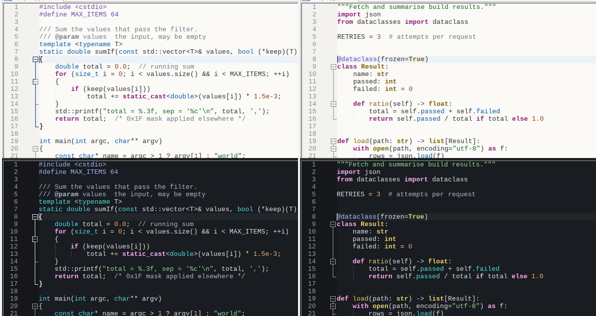

# Lucid Light and Lucid Dark: Notepad++ themes for legible code

Two themes, one pair: `Lucid Light.xml` for bright rooms and long reading, `Lucid Dark.xml` for dim rooms.
Every colour is computed from a contrast target, not picked by eye. Both cover all 93 lexers and 1,774 styles of
Notepad++'s `stylers.model.xml` (2026-05-25).



(The screenshots were taken under Wine, where Consolas is replaced by DejaVu Sans Mono and Notepad++ draws
with GDI.)

## Install

1. Copy both `.xml` files into Notepad++'s themes folder:
   - installed Notepad++: `%APPDATA%\Notepad++\themes\` (create the folder if it's missing);
   - portable Notepad++, or one started with `-settingsDir=<dir>`: `<that folder>\themes\`.
2. Restart Notepad++.
3. In light mode: **Settings > Style Configurator > Select theme: Lucid Light > Save & Close**.
4. **Settings > Preferences > Dark Mode**: turn dark mode on. Then choose **Lucid Dark** in the Style Configurator.

Notepad++ remembers one theme per mode (`darkThemeName` and `lightThemeName` in `config.xml`), so after this,
switching between light and dark mode also switches the theme. "Follow Windows" works the same way.

The themes set the editor font to Consolas 10 pt, like Notepad++'s own themes. To use a different font or size,
change **Global Styles > Default Style** after selecting the theme.

## How the colours were chosen

| | Lucid Light | Lucid Dark | Why |
|---|---|---|---|
| Background | `#FBFAF7` | `#191C20` | Off-white and dark grey, not white and black: less glare and smear |
| Text | `#272B2F`, Lc 98 | `#E2E6ED`, Lc 90 | Text sits on the reading-speed plateau, with margin |
| Keywords (bold) | magenta `#871D77`, Lc 85 | pink `#FEAFF7`, Lc 73 | |
| Types | blue `#0155A8`, Lc 82 | cyan `#52E0E7`, Lc 75 | |
| Strings | green `#10641D`, Lc 82 | green `#91DF94`, Lc 75 | |
| Numbers | rust `#963509`, Lc 82 | orange `#FFAD75`, Lc 67 | |
| Functions, classes | ochre `#7B5C02`, Lc 78 | yellow `#EBD271`, Lc 78 | |
| Preprocessor, macros, variables | violet `#6343A4`, Lc 82 | periwinkle `#ABBAFF`, Lc 66 | |
| Errors (tinted background) | red `#A31B22`, Lc 82 | red `#FF9B94`, Lc 62 | |
| Comments | grey `#687582`, Lc 70 | grey `#AFBCCB`, Lc 64 | Quieter than code, but still text you can read |

Lc is APCA lightness contrast, the perceptual contrast measure in the WCAG 3 drafts. Its guidance is Lc 90 for body
text, Lc 75 at least for body text, and Lc 60 at least for other text people read. In WCAG 2 terms, every syntax
colour in the dark theme is at least 8.4:1, above the AAA level of 7:1. In the light theme every syntax colour is at
least 6:1, above the AA level of 4.5:1. Every style in both files is at least Lc 60 against its own background
(`check.py`). Most are much higher.

The decisions, with the evidence for each:

1. **Contrast comes from lightness, not hue.** With colour contrast alone, text reads more slowly than with
   luminance contrast (Legge, Parish, Luebker & Wurm 1990). So every colour is placed by its lightness against the
   background first, and the hue comes second.
2. **Enough contrast, not maximum contrast.** Reading speed rises with contrast up to a point well above
   threshold, then levels off (Legge, Rubin & Luebker 1987; the "contrast reserve" of Whittaker & Lovie-Kitchin 1993).
   - Plain text is set comfortably on that plateau.
   - In the dark theme, text is kept below pure white (Lc 90 instead of the maximum of about 106). This is a design
     judgment to reduce glare from bright strokes; there's no study measuring it directly.
3. **Both polarities, chosen by the room.**
   - Dark text on a light background gives better proofreading accuracy and acuity at every age tested. The likely
     reason is the smaller pupil (Buchner & Baumgartner 2007; Piepenbrock, Mayr, Mund & Buchner 2013; Piepenbrock,
     Mayr & Buchner 2014).
   - In a dim room, a bright screen is uncomfortable.
   - So the pair is meant to be switched with the lighting, which Notepad++ does with dark mode.
4. **Colours must still show in thin strokes.**
   - The eye resolves colour much more coarsely than lightness (Mullen 1985). In 10 pt screenshots, colours with an
     OKLCH chroma below about 0.10 read as plain text.
   - So each syntax colour has a minimum chroma (0.10 to 0.17). It gets the highest contrast at which that chroma
     still fits in sRGB.
   - The sRGB gamut is lopsided. Near white it holds saturated yellows, greens and cyans but only pale blues and
     reds; near black it's the other way round. That's why the dark theme leans yellow-green-cyan and the light
     theme blue-violet-red.
   - Each role keeps the same colour family in both themes, so switching themes doesn't change what a colour means.
5. **Colour blindness.**
   - About 8% of men of European descent, and 0.5% of women, have red-green colour vision deficiency (Birch 2012).
   - Every colour was simulated for protanopia, deuteranopia and tritanopia (Machado, Oliveira & Fernandes 2009),
     and the distances are in `palette-report.md`.
   - Keywords and strings, the most frequent pair, stay well apart in all of them (ΔE_OK 0.12 to 0.30). Some pairs
     can't all be kept apart for every deficiency, for example blue types and violet macros for deuteranopes. There,
     bold keywords and the lightness steps between text, syntax colours and comments carry the difference.
6. **Restrained colour, no italics.**
   - Studies find that syntax highlighting helps only modestly (Sarkar 2015), or not measurably for novices
     (Hannebauer, Hesenius & Gruhn 2018). So these themes put the legibility of every token first and add colour
     only where it marks a category.
   - Italics slow reading slightly (Tinker 1963), so comments are set apart by lightness and stay upright.
7. **No "eye-friendly" tint.** A Cochrane review found no evidence that filtering blue light reduces eye strain
   (Singh et al. 2023). The backgrounds are near-neutral. Screen brightness matched to the room matters more than
   the background's hue.

Highlights were checked as Notepad++ draws them: smart highlighting, search marks and Mark Styles 1-5 are
rounded boxes under the text at alpha 100/255. On every one of them, plain text stays at Lc 76 or above in the dark
theme and Lc 80 or above in the light theme. Selection and the current-line background were checked the same way.

## Font size

Reading speed is highest when the x-height spans at least about 0.2° of visual angle, the critical print size of
normally sighted adults (Legge & Bigelow 2011). Older eyes need more. Consolas's x-height is 0.49 em, so:

  x-height in mm = 16.65 × points × Windows scale ÷ screen pixels per inch

At 60 cm, 0.2° is 2.1 mm:

- a 24-inch 1080p monitor at 100% scale (92 ppi) needs about **12 pt**;
- a 27-inch 1440p monitor at 125% scale (109 ppi) needs about **11 pt**.

Ctrl + mouse wheel zooms if a fixed size isn't wanted.

## Files

| File | What |
|---|---|
| `Lucid Light.xml`, `Lucid Dark.xml` | The themes |
| `colormath.py` | sRGB, OKLab/OKLCH, APCA-W3 0.0.98G-4g, WCAG 2, colour-blindness simulation (checked against APCA's published values) |
| `palette.py` | The two palettes as contrast and chroma targets; `python3 palette.py` prints `palette-report.md` |
| `gen_theme.py` | Writes both themes from `stylers.model.xml`: each style gets a role from its name, or from its colour in the model when the name says nothing; layout and comments are kept |
| `check.py` | Same lexers, styles and IDs as the model; contrast of every style |
| `palette-report.md` | Contrast on background, current line, selection and highlights; colour-blindness distances |
| `roles.tsv` | The role chosen for each of the 1,774 styles, and how it was chosen |

Regenerate after a Notepad++ update adds lexers:

```sh
python3 gen_theme.py <repo>/PowerEditor/src/stylers.model.xml <repo>/PowerEditor/installer/themes/DarkModeDefault.xml .
python3 check.py <repo>/PowerEditor/src/stylers.model.xml "Lucid Light.xml" "Lucid Dark.xml"
```

## References

- Birch J (2012). Worldwide prevalence of red-green color deficiency. *J Opt Soc Am A* 29(3):313-320.
- Buchner A, Baumgartner N (2007). Text-background polarity affects performance irrespective of ambient
  illumination and colour contrast. *Ergonomics* 50(7):1036-1063.
- Hannebauer C, Hesenius M, Gruhn V (2018). Does syntax highlighting help programming novices? *Empirical
  Software Engineering* 23:2795-2828.
- Legge GE, Bigelow CA (2011). Does print size matter for reading? A review of findings from vision science and
  typography. *J Vision* 11(5):8.
- Legge GE, Parish DH, Luebker A, Wurm LH (1990). Psychophysics of reading XI: comparing color contrast and
  luminance contrast. *J Opt Soc Am A* 7(10):2002-2010.
- Legge GE, Rubin GS, Luebker A (1987). Psychophysics of reading V: the role of contrast in normal vision.
  *Vision Research* 27(7):1165-1177.
- Machado GM, Oliveira MM, Fernandes LAF (2009). A physiologically-based model for simulation of color vision
  deficiency. *IEEE TVCG* 15(6):1291-1298.
- Mullen KT (1985). The contrast sensitivity of human colour vision to red-green and blue-yellow chromatic
  gratings. *J Physiol* 359:381-400.
- Ottosson B (2020). A perceptual color space for image processing (OKLab).
- Piepenbrock C, Mayr S, Mund I, Buchner A (2013). Positive display polarity is advantageous for both younger and
  older adults. *Ergonomics* 56(7):1116-1124.
- Piepenbrock C, Mayr S, Buchner A (2014). Smaller pupil size and better proofreading performance with positive
  than with negative polarity displays. *Ergonomics* 57(11):1670-1677.
- Sarkar A (2015). The impact of syntax colouring on program comprehension. *PPIG 2015*.
- Singh S, Keller PR, Busija L, et al. (2023). Blue-light filtering spectacles for improving visual performance,
  sleep, and macular health in adults. *Cochrane Database Syst Rev* 8:CD013244.
- Somers A. APCA, the Accessible Perceptual Contrast Algorithm (APCA-W3 0.0.98G-4g).
- Tinker MA (1963). *Legibility of Print*. Iowa State University Press.
- Whittaker SG, Lovie-Kitchin J (1993). Visual requirements for reading. *Optom Vis Sci* 70(1):54-65.
